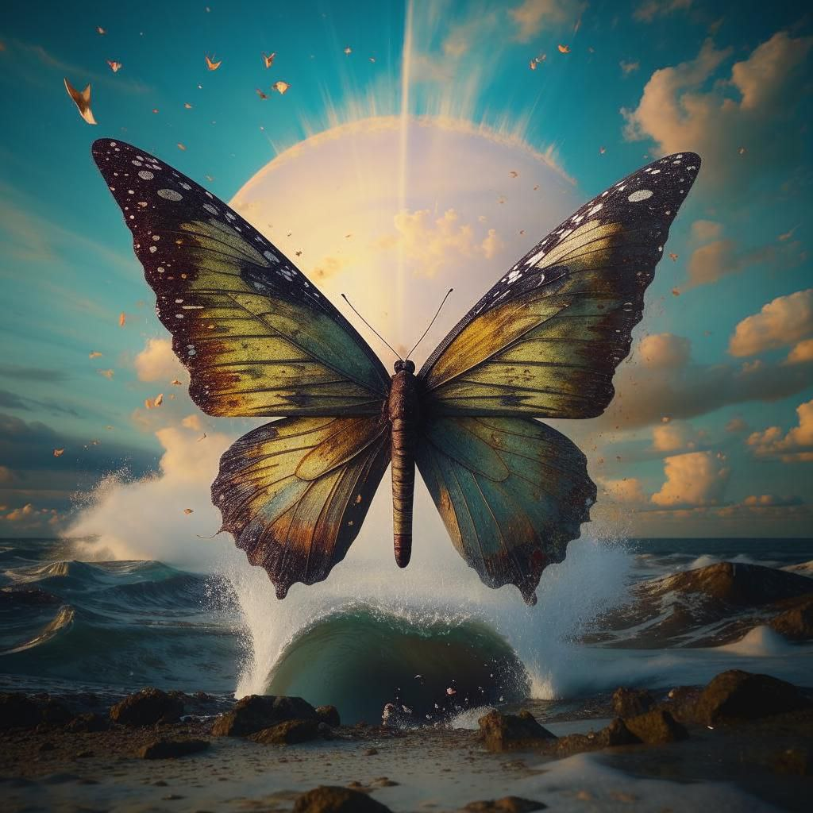
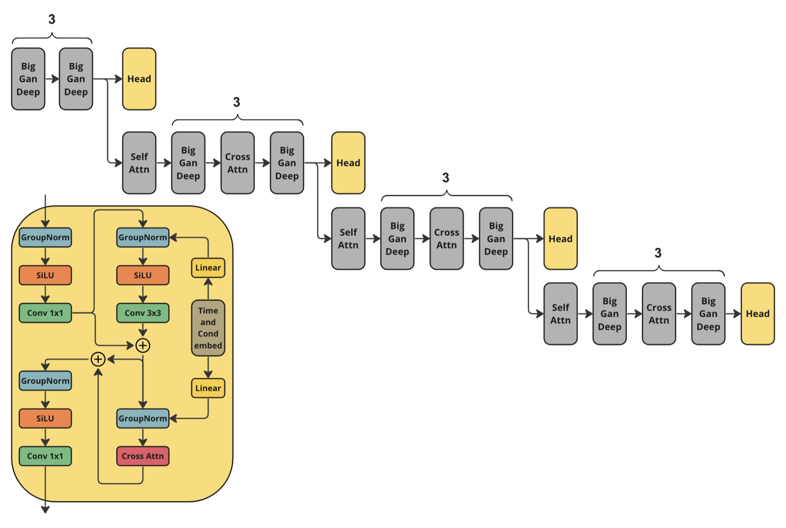
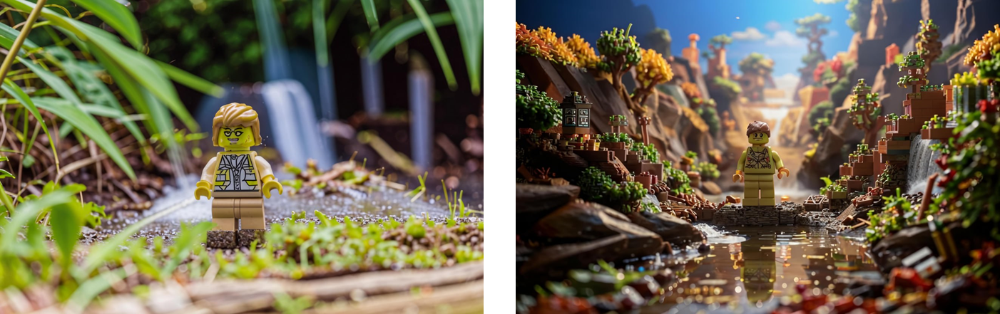
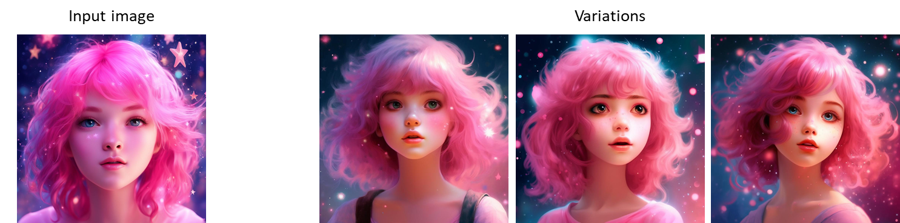

# Kandinsky-3: Text-to-image diffusion model


[Kandinsky 3.0 Post](https://habr.com/ru/companies/sberbank/articles/775590/) | [Kandinsky 3.1 Post](https://habr.com/ru/companies/sberbank/articles/805337/) | [Project Page](https://ai-forever.github.io/Kandinsky-3) | [Generate](https://fusionbrain.ai) | [Telegram-bot](https://t.me/kandinsky21_bot) | [Technical Report](https://arxiv.org/pdf/2312.03511.pdf) |  [HuggingFace](https://huggingface.co/kandinsky-community/kandinsky-3) |

# Kandinsky 3.1:

## Description:

We present Kandinsky 3.1, the follow-up to the Kandinsky 3.0 model, a large-scale text-to-image generation model based on latent diffusion, continuing the series of text-to-image Kandinsky models and reflecting our progress to achieve higher quality and realism of image generation, which we have enhanced and enriched with a variety of useful features and modes to give users more opportunities to fully utilise the power of our new model.

## Kandinsky Flash (Kandinsky 3.0 Refiner)

<figure>
  
</figure>


Diffusion models have problems with fast image generation. To address this problem, we trained a Kandinksy Flash model based on the [Adversarial Diffusion Distillation](https://arxiv.org/abs/2311.17042) approach with some modifications: we trained the model on latents, which reduced the memory overhead and removed distillation loss as it did not affect the training. Also, we applied Kandinsky Flash model to images generated from Kandinsky 3.0 to improve visual quality of generated images.

### Architecture

For training Kandinsky Flash we used the following architecture of discriminator. It is the half of Kandinsky 3.0 U-Net encoder with additional head predictions.



### How to use:
Check our jupyter notebooks with examples in `./examples` folder

```python
from kandinsky3 import get_T2I_Flash_pipeline

device_map = torch.device('cuda:0')
dtype_map = {
    'unet': torch.float32,
    'text_encoder': torch.float16,
    'movq': torch.float32,
}

t2i_pipe = get_T2I_Flash_pipeline(
    device_map, dtype_map
)

res = t2i_pipe("A cute corgi lives in a house made out of sushi.")
```
### Kandinsky Inpainting

Also, we released a newer version of inpainting model, which we additionally trained the model on the object detection dataset. This allowed to get more stable generation of objects. The new weights are available at [ai-forever/Kandinsky3.1](https://huggingface.co/ai-forever/Kandinsky3.1). Check the usage [example](https://github.com/ai-forever/Kandinsky-3?tab=readme-ov-file#2-inpainting).


## Prompt beautification

<figure>
  
</figure>


Prompt plays crucial role in text-to-image generation. So, in Kandinsky 3.1 we decided to use language model for making prompt better. We used Intel's [neural-chat-7b-v3-1](https://huggingface.co/Intel/neural-chat-7b-v3-1) with the following system prompt as the LLM:

```
### System: You are a prompt engineer. Your mission is to expand prompts written by user. You should provide the best prompt for text to image generation in English.
### User:
{prompt}
### Assistant:
{answer of the model}
```

## KandiSuperRes

<figure>
  
</figure>

To learn more about KandiSuperRes, please checkout: https://github.com/ai-forever/KandiSuperRes/

## Kandinsky IP-Adapter & Kandinsky ControlNet

<figure>
  
</figure>

To allow using image as condition in Kandinsky model, we trained IP-Adapter and HED-based ControlNet model. For more details please check out: https://github.com/ai-forever/kandinsky3-diffusers

# Kandinsky 3.0:

## Description:

Kandinsky 3.0 is an open-source text-to-image diffusion model built upon the Kandinsky2-x model family. In comparison to its predecessors, Kandinsky 3.0 incorporates more data and specifically related to Russian culture, which allows to generate pictures related to Russin culture. Furthermore, enhancements have been made to the text understanding and visual quality of the model, achieved by increasing the size of the text encoder and Diffusion U-Net models, respectively.

For more information: details of training, example of generations check out our [post](). The english version will be released in a couple of days.

## Architecture details:


Architecture consists of three parts:

+ Text encoder Flan-UL2 (encoder part) - 8.6B
+ Latent Diffusion U-Net - 3B
+ MoVQ encoder/decoder - 267M


## Models

We release our two models:

+ [Base](): Base text-to-image diffusion model. This model was trained over 2M steps on 400 A100
+ [Inpainting](): Inpainting version of the model. The model was initialized from final checkpoint of base model and trained 250k steps on 300 A100.

## Installing

To install repo first one need to create conda environment:

```
conda create -n kandinsky -y python=3.8;
source activate kandinsky;
pip install torch==1.10.1+cu111 torchvision==0.11.2+cu111 torchaudio==0.10.1 -f https://download.pytorch.org/whl/cu113/torch_stable.html;
pip install -r requirements.txt;
```
The exact dependencies is got using `pip freeze` and can be found in `exact_requirements.txt`

## How to use:

Check our jupyter notebooks with examples in `./examples` folder

### 1. text2image

```python
import sys
sys.path.append('..')

import torch
from kandinsky3 import get_T2I_pipeline

device_map = torch.device('cuda:0')
dtype_map = {
    'unet': torch.float32,
    'text_encoder': torch.float16,
    'movq': torch.float32,
}

t2i_pipe = get_T2I_pipeline(
    device_map, dtype_map,
)
res = t2i_pipe("A cute corgi lives in a house made out of sushi.")

res[0]
```

### 2. inpainting

```python
from kandinsky3 import get_inpainting_pipeline

device_map = torch.device('cuda:0')
dtype_map = {
    'unet': torch.float16,
    'text_encoder': torch.float16,
    'movq': torch.float32,
}

inp_pipe = get_inpainting_pipeline(
    device_map, dtype_map,
)

image = ... # PIL Image
mask = ... # Numpy array (HxW). Set 1 where image should be masked
image = inp_pipe( "A cute corgi lives in a house made out of sushi.", image, mask)
```

## Examples of generations

<hr>

<table class="center">
<tr>
  <td></td>
  <td></td>
  <td></td>
  <td></td>
</tr>
<tr>
  <td width=25% align="center">"A beautiful landscape outdoors scene in the crochet knitting art style, drawing in style by Alfons Mucha"</td>
  <td width=25% align="center">"gorgeous phoenix, cosmic, darkness, epic, cinematic, moonlight, stars, high - definition, texture,Oscar-Claude Monet"</td>
  <td width=25% align="center">"a yellow house at the edge of the danish fjord, in the style of eiko ojala, ingrid baars, ad posters, mountainous vistas, george ault, realistic details, dark white and dark gray, 4k"</td>
  <td width=25% align="center">"dragon fruit head, upper body, realistic, illustration by Joshua Hoffine Norman Rockwell, scary, creepy, biohacking, futurism, Zaha Hadid style"</td>
</tr>
<tr>
  <td></td>
  <td></td>
  <td></td>
  <td></td>
</tr>
<tr>
  <td width=25% align="center">"Amazing playful nice cute strawberry character, dynamic poze, surreal fantazy garden background, gorgeous masterpice, award winning photo, soft natural lighting, 3d, Blender, Octane render, tilt - shift, deep field, colorful, I can't believe how beautiful this is, colorful, cute and sweet baby - loved photo"</td>
  <td width=25% align="center">"beautiful fairy-tale desert, in the sky a wave of sand merges with the milky way, stars, cosmism, digital art, 8k"</td>
  <td width=25% align="center">"Car, mustang, movie, person, poster, car cover, person, in the style of alessandro gottardo, gold and cyan, gerald harvey jones, reflections, highly detailed illustrations, industrial urban scenes""</td>
  <td width=25% align="center">"cloud in blue sky, a red lip, collage art, shuji terayama, dreamy objects, surreal, criterion collection, showa era, intricate details, mirror"</td>
</tr>

</table>

<hr>

## Authors

+ Vladimir Arkhipkin: [Github](https://github.com/oriBetelgeuse)
+ Anastasia Maltseva [Github](https://github.com/NastyaMittseva)
+ Andrei Filatov [Github](https://github.com/anvilarth), 
+ Igor Pavlov: [Github](https://github.com/boomb0om)
+ Julia Agafonova 
+ Arseniy Shakhmatov: [Github](https://github.com/cene555), [Blog](https://t.me/gradientdip)
+ Andrey Kuznetsov: [Github](https://github.com/kuznetsoffandrey), [Blog](https://t.me/complete_ai)
+ Denis Dimitrov: [Github](https://github.com/denndimitrov), [Blog](https://t.me/dendi_math_ai)

## Citation

```bibtex
@inproceedings{vladimir-etal-2024-kandinsky,
    title = "Kandinsky 3: Text-to-Image Synthesis for Multifunctional Generative Framework",
    author = "Vladimir, Arkhipkin  and
      Vasilev, Viacheslav  and
      Filatov, Andrei  and
      Pavlov, Igor  and
      Agafonova, Julia  and
      Gerasimenko, Nikolai  and
      Averchenkova, Anna  and
      Mironova, Evelina  and
      Anton, Bukashkin  and
      Kulikov, Konstantin  and
      Kuznetsov, Andrey  and
      Dimitrov, Denis",
    editor = "Hernandez Farias, Delia Irazu  and
      Hope, Tom  and
      Li, Manling",
    booktitle = "Proceedings of the 2024 Conference on Empirical Methods in Natural Language Processing: System Demonstrations",
    month = nov,
    year = "2024",
    address = "Miami, Florida, USA",
    publisher = "Association for Computational Linguistics",
    url = "https://aclanthology.org/2024.emnlp-demo.48",
    pages = "475--485",
    abstract = "Text-to-image (T2I) diffusion models are popular for introducing image manipulation methods, such as editing, image fusion, inpainting, etc. At the same time, image-to-video (I2V) and text-to-video (T2V) models are also built on top of T2I models. We present Kandinsky 3, a novel T2I model based on latent diffusion, achieving a high level of quality and photorealism. The key feature of the new architecture is the simplicity and efficiency of its adaptation for many types of generation tasks. We extend the base T2I model for various applications and create a multifunctional generation system that includes text-guided inpainting/outpainting, image fusion, text-image fusion, image variations generation, I2V and T2V generation. We also present a distilled version of the T2I model, evaluating inference in 4 steps of the reverse process without reducing image quality and 3 times faster than the base model. We deployed a user-friendly demo system in which all the features can be tested in the public domain. Additionally, we released the source code and checkpoints for the Kandinsky 3 and extended models. Human evaluations show that Kandinsky 3 demonstrates one of the highest quality scores among open source generation systems.",
}
```

```bibtex
@misc{arkhipkin2023kandinsky,
      title={Kandinsky 3.0 Technical Report}, 
      author={Vladimir Arkhipkin and Andrei Filatov and Viacheslav Vasilev and Anastasia Maltseva and Said Azizov and Igor Pavlov and Julia Agafonova and Andrey Kuznetsov and Denis Dimitrov},
      year={2023},
      eprint={2312.03511},
      archivePrefix={arXiv},
      primaryClass={cs.CV}
}
```
