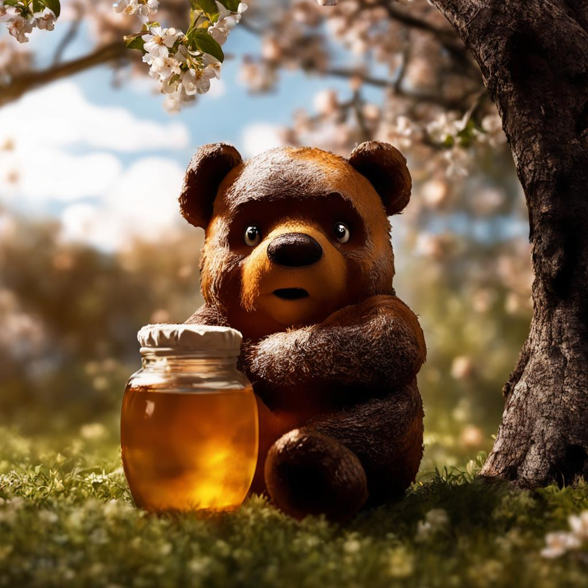
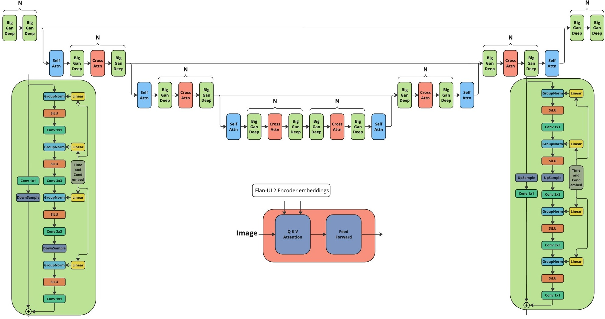
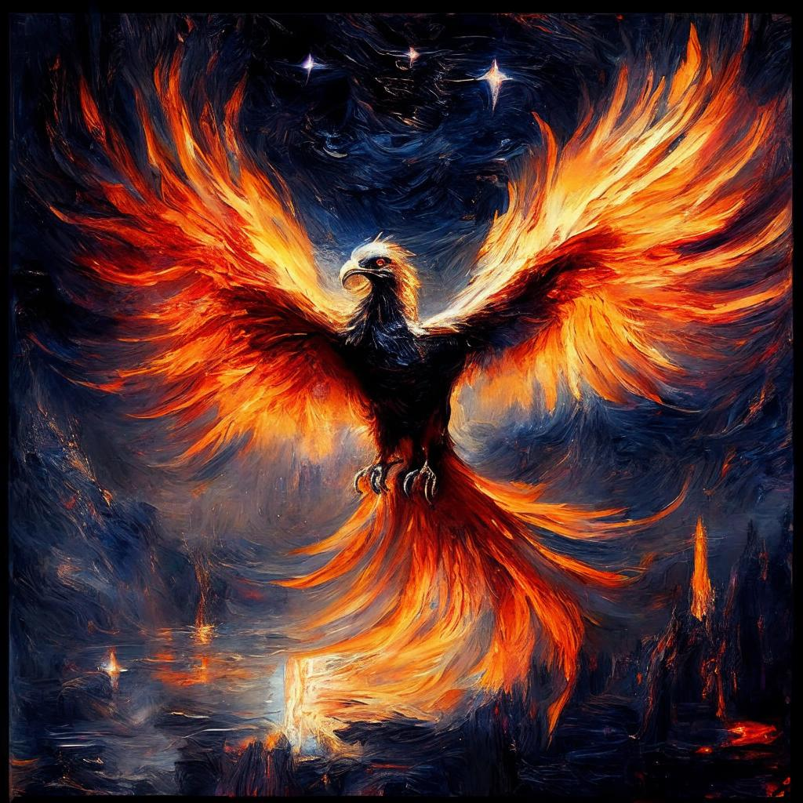
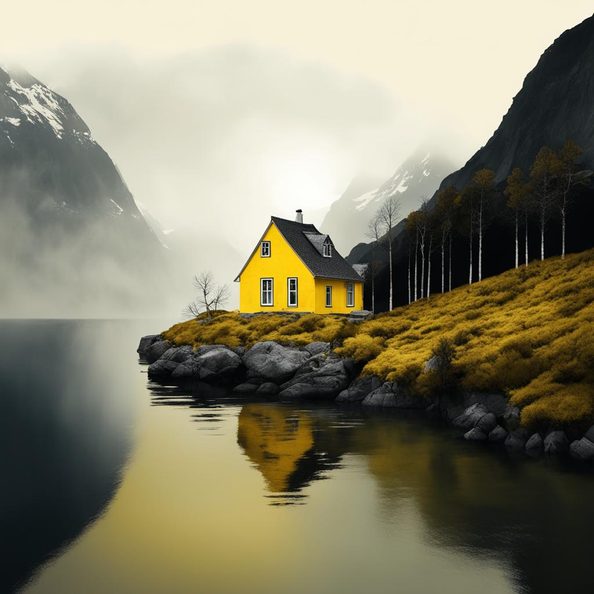
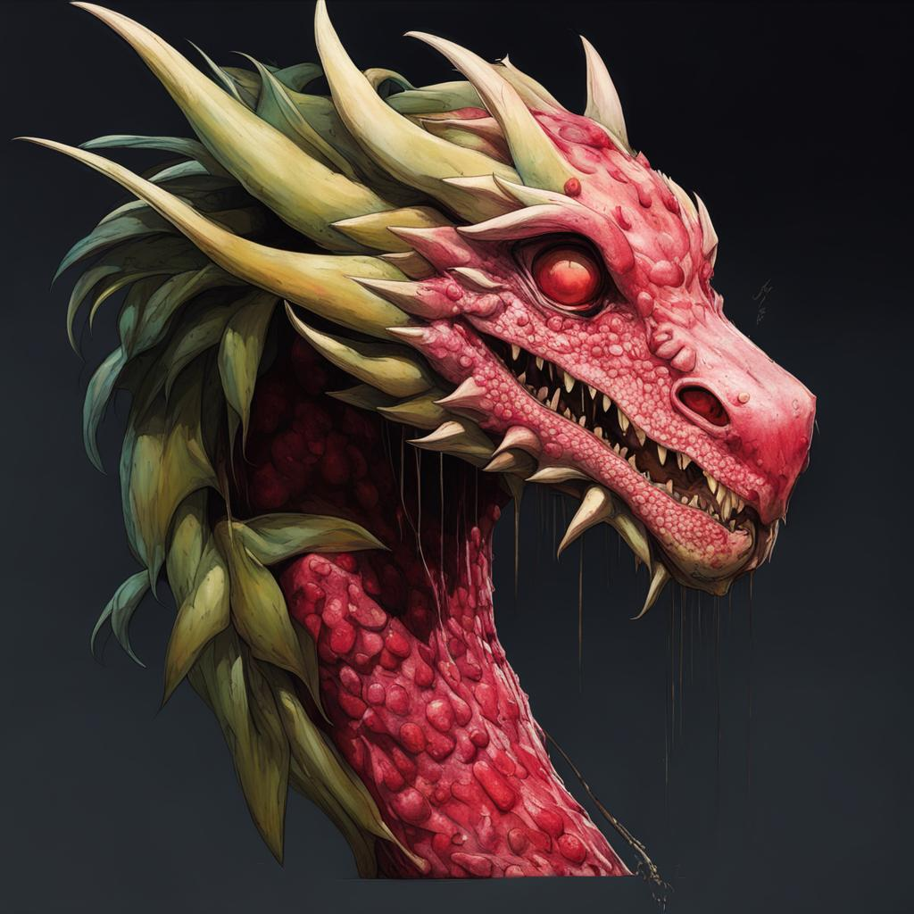
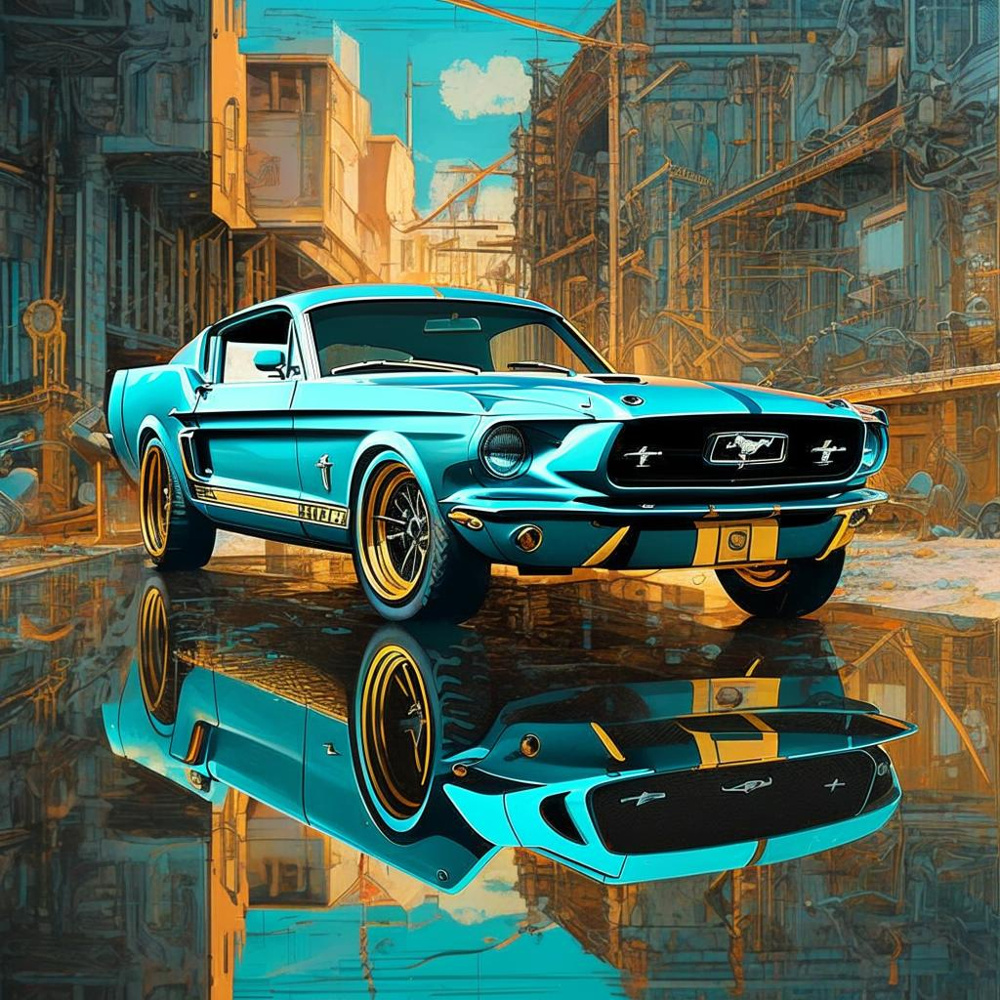
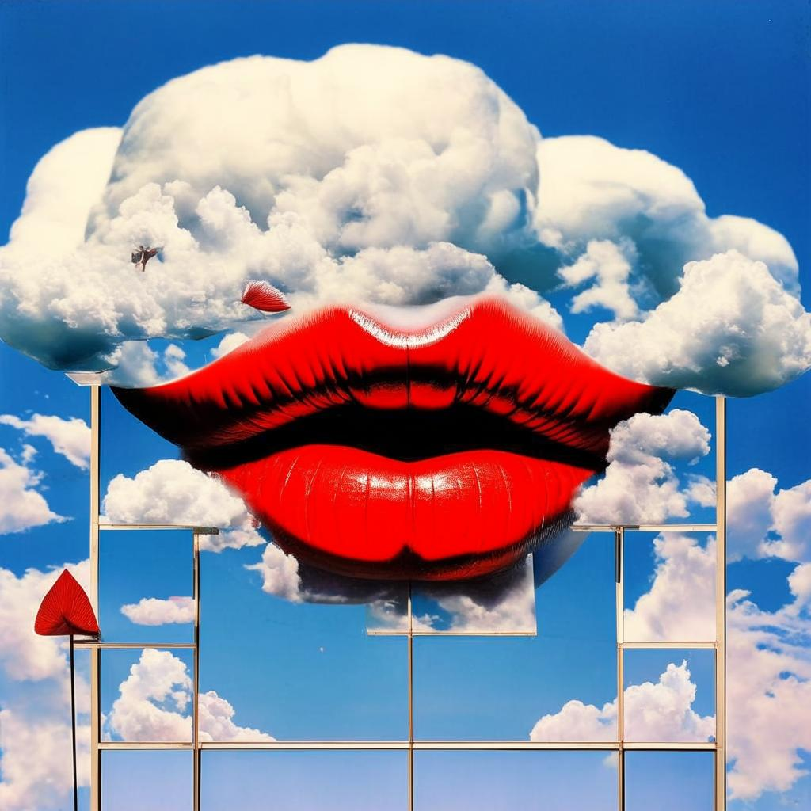

# Kandinsky-3: Text-to-image diffusion model



[Post](https://habr.com/ru/companies/sberbank/articles/775590/) | [Medium Post](https://medium.com/@filatovandreiv/kandinsky-3-0-a-new-model-for-generating-images-from-text-abe13e3bd6ab) | [Project Page](https://ai-forever.github.io/Kandinsky-3) | [Generate](https://fusionbrain.ai) | [Telegram-bot](https://t.me/kandinsky21_bot) | [Technical Report](https://arxiv.org/pdf/2312.03511.pdf)

## Description:

Kandinsky 3.0 is an open-source text-to-image diffusion model built upon the Kandinsky2-x model family. In comparison to its predecessors, Kandinsky 3.0 incorporates more data and specifically related to Russian culture, which allows to generate pictures related to Russin culture. Furthermore, enhancements have been made to the text understanding and visual quality of the model, achieved by increasing the size of the text encoder and Diffusion U-Net models, respectively.

For more information: details of training, example of generations check out our [post](). The english version will be released in a couple of days.

## Architecture details:





Architecture consists of three parts:

+ Text encoder Flan-UL2 (encoder part) - 8.6B
+ Latent Diffusion U-Net - 3B
+ MoVQ encoder/decoder - 267M


## Models

We release our two models:

+ [Base](): Base text-to-image diffusion model. This model was trained over 2M steps on 400 A100
+ [Inpainting](): Inpainting version of the model. The model was initialized from final checkpoint of base model and trained 250k steps on 300 A100.

## Installing

To install repo first one need to create conda environment:

```
conda create -n kandinsky -y python=3.8;
source activate kandinsky;
pip install torch==1.10.1+cu111 torchvision==0.11.2+cu111 torchaudio==0.10.1 -f https://download.pytorch.org/whl/cu113/torch_stable.html;
pip install -r requirements.txt;
```
The exact dependencies is got using `pip freeze` and can be found in `exact_requirements.txt`

## How to use:

Check our jupyter notebooks with examples in `./examples` folder

### 1. text2image

```python
from kandinsky3 import get_T2I_pipeline

t2i_pipe = get_T2I_pipeline('cuda', fp16=True)

image = t2i_pipe( "A cute corgi lives in a house made out of sushi.")
```

### 2. inpainting

```python
from kandinsky3 import get_inpainting_pipeline

inp_pipe = get_inpainting_pipeline('cuda', fp16=True)

image = ... # PIL Image
mask = ... # Numpy array (HxW). Set 1 where image should be masked
image = inp_pipe( "A cute corgi lives in a house made out of sushi.", image, mask)
```

## Examples of generations

<hr>

<table class="center">
<tr>
  <td></td>
  <td></td>
  <td></td>
  <td></td>
</tr>
<tr>
  <td width=25% align="center">"A beautiful landscape outdoors scene in the crochet knitting art style, drawing in style by Alfons Mucha"</td>
  <td width=25% align="center">"gorgeous phoenix, cosmic, darkness, epic, cinematic, moonlight, stars, high - definition, texture,Oscar-Claude Monet"</td>
  <td width=25% align="center">"a yellow house at the edge of the danish fjord, in the style of eiko ojala, ingrid baars, ad posters, mountainous vistas, george ault, realistic details, dark white and dark gray, 4k"</td>
  <td width=25% align="center">"dragon fruit head, upper body, realistic, illustration by Joshua Hoffine Norman Rockwell, scary, creepy, biohacking, futurism, Zaha Hadid style"</td>
</tr>
<tr>
  <td></td>
  <td></td>
  <td></td>
  <td></td>
</tr>
<tr>
  <td width=25% align="center">"Amazing playful nice cute strawberry character, dynamic poze, surreal fantazy garden background, gorgeous masterpice, award winning photo, soft natural lighting, 3d, Blender, Octane render, tilt - shift, deep field, colorful, I can't believe how beautiful this is, colorful, cute and sweet baby - loved photo"</td>
  <td width=25% align="center">"beautiful fairy-tale desert, in the sky a wave of sand merges with the milky way, stars, cosmism, digital art, 8k"</td>
  <td width=25% align="center">"Car, mustang, movie, person, poster, car cover, person, in the style of alessandro gottardo, gold and cyan, gerald harvey jones, reflections, highly detailed illustrations, industrial urban scenes""</td>
  <td width=25% align="center">"cloud in blue sky, a red lip, collage art, shuji terayama, dreamy objects, surreal, criterion collection, showa era, intricate details, mirror"</td>
</tr>

</table>

<hr>

## Authors

+ Vladimir Arkhipkin: [Github](https://github.com/oriBetelgeuse)
+ Anastasia Maltseva [Github](https://github.com/NastyaMittseva)
+ Andrei Filatov [Github](https://github.com/anvilarth), 
+ Igor Pavlov: [Github](https://github.com/boomb0om)
+ Julia Agafonova 
+ Arseniy Shakhmatov: [Github](https://github.com/cene555), [Blog](https://t.me/gradientdip)
+ Andrey Kuznetsov: [Github](https://github.com/kuznetsoffandrey), [Blog](https://t.me/complete_ai)
+ Denis Dimitrov: [Github](https://github.com/denndimitrov), [Blog](https://t.me/dendi_math_ai)

## Citation
```
@misc{arkhipkin2023kandinsky,
      title={Kandinsky 3.0 Technical Report}, 
      author={Vladimir Arkhipkin and Andrei Filatov and Viacheslav Vasilev and Anastasia Maltseva and Said Azizov and Igor Pavlov and Julia Agafonova and Andrey Kuznetsov and Denis Dimitrov},
      year={2023},
      eprint={2312.03511},
      archivePrefix={arXiv},
      primaryClass={cs.CV}
}
```

